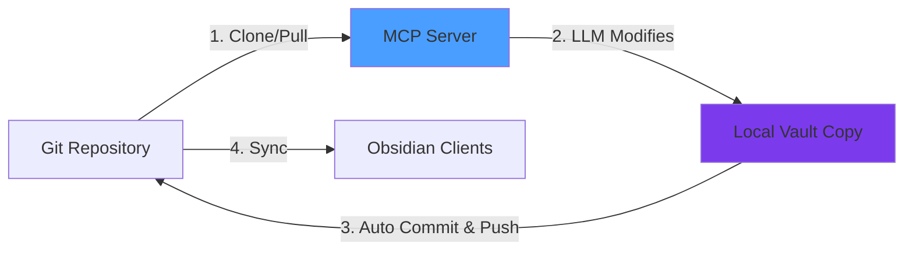

# BrainMCP


A Model Context Protocol (MCP) server for git-backed Obsidian vaults. Access and manage your notes through Claude, ChatGPT, and other LLMs by syncing changes via git.

> Originally based on [eddmann/obsidian-mcp](https://github.com/eddmann/obsidian-mcp) (MIT). BrainMCP is maintained independently and adds the vault guards, vault conventions, and vault-taught orientation described below.

## Table of Contents

- [Overview](#overview)
- [Quick Start](#quick-start)
- [Vault Guards](#vault-guards)
- [Vault Conventions](#vault-conventions)
- [How It Works](#how-it-works)
- [Prerequisites](#prerequisites)
- [Deployment Options](#deployment-options)
  - [Claude Desktop (Local)](#claude-desktop-local)
  - [ChatGPT & Remote Clients](#chatgpt--remote-clients)
  - [AWS Lambda](#aws-lambda)
- [Usage Examples](#usage-examples)
- [Tool Reference](#tool-reference)
- [Resources](#resources)
- [Documentation](#documentation)
- [License](#license)

## Overview

This MCP server provides tools, prompts, and resources to interact with your Obsidian vault through LLMs. The vault can also teach clients how to use it — see [Brain orientation](docs/BRAIN-ORIENTATION.md) for the `brain://protocol` resource, the `brain-orient` prompt, and the `orient` tool:

Tool Categories:

- File Operations (9) - Read, create, edit, delete, move, append, and patch notes
- Directory Operations (3) - Create directories and list files
- Search (1) - Fuzzy search with relevance scoring and exact matching
- Tag Management (4) - Add, remove, rename, and manage tags
- Journal Logging (1) - Auto-log LLM activity to daily journals
- Convention-aware (2) - Capture to inbox and add tasks, with structure enforced server-side

Deployment Modes:

- Stdio - Local deployment for Claude Desktop, Cursor
- HTTP - Local/remote with OAuth for ChatGPT, Claude web
- AWS Lambda - Serverless deployment with DynamoDB sessions

## Quick Start

Get started with Claude Desktop in 3 steps using Docker:

```bash
# 1. Download the example environment file
curl -O https://raw.githubusercontent.com/jmashburn/BrainMCP/main/.env.example
mv .env.example obsidian-mcp.env

# 2. Edit obsidian-mcp.env with your vault repo and git token
# Required fields:
#   VAULT_REPO=https://github.com/username/vault-repo.git
#   VAULT_BRANCH=main
#   GIT_TOKEN=your_token_here
```

**3. Add to Claude Desktop config:**

<details>
<summary>macOS: <code>~/Library/Application Support/Claude/claude_desktop_config.json</code></summary>

```json
{
  "mcpServers": {
    "obsidian": {
      "command": "docker",
      "args": [
        "run",
        "-i",
        "--rm",
        "-v",
        "/ABSOLUTE/PATH/TO/obsidian-mcp.env:/app/.env",
        "ghcr.io/jmashburn/brainmcp:latest",
        "stdio"
      ]
    }
  }
}
```

</details>

<details>
<summary>Windows: <code>%APPDATA%\Claude\claude_desktop_config.json</code></summary>

```json
{
  "mcpServers": {
    "obsidian": {
      "command": "docker",
      "args": [
        "run",
        "-i",
        "--rm",
        "-v",
        "C:\\ABSOLUTE\\PATH\\TO\\obsidian-mcp.env:/app/.env",
        "ghcr.io/jmashburn/brainmcp:latest",
        "stdio"
      ]
    }
  }
}
```

</details>

Restart Claude Desktop and start chatting with your vault!

<details>
<summary><b>Prefer npm?</b> Click here for npm-based setup</summary>

```bash
# 1. Clone and install
git clone https://github.com/jmashburn/BrainMCP
cd BrainMCP
npm install

# 2. Configure credentials
cp .env.example .env
# Edit .env with your vault repo and git token
```

**3. Add to Claude Desktop config:**

macOS: `~/Library/Application Support/Claude/claude_desktop_config.json`

```json
{
  "mcpServers": {
    "obsidian": {
      "command": "npm",
      "args": ["run", "--prefix", "/ABSOLUTE/PATH/TO/obsidian-mcp", "dev"]
    }
  }
}
```

Windows: `%APPDATA%\Claude\claude_desktop_config.json`

```json
{
  "mcpServers": {
    "obsidian": {
      "command": "npm",
      "args": ["run", "--prefix", "C:\\ABSOLUTE\\PATH\\TO\\obsidian-mcp", "dev"]
    }
  }
}
```

</details>

## Vault Guards

Exposing a vault to a remote client is a different threat model from a local
stdio server driven by one trusted process. Three guards, all opt-out rather
than opt-in, because an operator who never reads this section is exactly the
one who needs them.

### Path containment

Every path is normalised and required to stay inside the vault. A client
supplying `../../.ssh/authorized_keys` is refused for reads and writes alike.
Enforced at the `VaultManager` boundary, so handlers added later inherit it.

### Protected paths

Some files govern how agents behave — instructions, conventions, commit hooks.
A client able to rewrite those rewrites the rules every _other_ client follows,
and can disable the scanning that guards the vault. They are refused for writes
and remain readable.

```bash
# Defaults: CLAUDE.md, AGENTS.md, .githooks/**, .github/**, .gitignore, .gitattributes
VAULT_PROTECTED_PATHS=CLAUDE.md,90-Meta/**,.githooks/**
```

Patterns support `*` (within a segment) and `**` (across segments), matched
case-insensitively so a vault on a case-insensitive filesystem cannot be
reached by a differently-cased spelling.

Whatever files are published as guidance (see below) are protected
automatically. Naming a file as the rules and leaving it writable is a gap that
would otherwise appear silently.

### Tool allowlist

Registering all tools suits a trusted local client, not an internet-reachable
server. `EXPOSED_TOOLS` is an allowlist; unset registers everything.

```bash
EXPOSED_TOOLS=read-note,read-notes,search-vault,capture-inbox,add-task,log-journal-entry
```

Skipped tools are absent from `tools/list` entirely, not merely refused on call
— a tool the model cannot see is one it cannot be talked into using.

### Read-only and read-write access

A credential grants either read access or read-and-write access. Which one is
decided where the credential is proven:

| Credential                                      | Read and write             | Read only                     |
| ----------------------------------------------- | -------------------------- | ----------------------------- |
| Login token (typed on the OAuth login page)     | `PERSONAL_AUTH_TOKEN`      | `PERSONAL_AUTH_TOKEN_RO`      |
| Static bearer token (`Authorization: Bearer …`) | `MCP_STATIC_BEARER_TOKENS` | `MCP_STATIC_BEARER_TOKENS_RO` |

OAuth tokens carry the level as a scope (`vault:read`, or `vault:read
vault:write`) and keep it across refreshes. A client may ask for a narrower
scope than its login allows — logging in with the read-write token while
requesting only `vault:read` yields a read-only token — but never a wider one.
The consent page says which is being granted.

Read-only access is enforced twice, and each layer holds without the other:

- **The tools are not there.** A read-only session is offered `read-note`,
  `read-notes`, `search-vault`, `list-files-in-vault`, `list-files-in-dir`,
  plus `orient`, `search` and `fetch`. Write tools are absent from
  `tools/list`, not merely refused. `EXPOSED_TOOLS` can narrow this further
  and cannot widen it.
- **The vault refuses.** A read-only session is handed a vault that rejects
  every write, so a write tool that reached it by mistake still could not
  write.

A session keeps the level it was opened with: presenting another credential's
session id gets a `403`, in either direction. Anything ambiguous fails closed —
a token listed at both levels, or the two login tokens set to the same value,
is read-only, and the server says so in its startup log.

Read-only limits what a client can _do_, not what it can _see_: it can still
read every note the path guards allow.

### Secret scanning in the image

The published image includes `gitleaks`, pinned, so a vault whose hook shells
out to it works without extra setup. Because such hooks fail closed, a missing
binary presents as _every write failing_ rather than scanning being off — the
entrypoint warns at startup when `VAULT_HOOKS_PATH` is set and `gitleaks` is
absent, so the cause is visible before the first write rather than after.

Build for a different version or architecture:

```bash
docker build --build-arg GITLEAKS_VERSION=8.30.1 -t brain-mcp .
```

### Vault-owned commit hooks

The server clones the vault and commits locally, so the vault's own hooks can
run against server-side writes:

```bash
VAULT_HOOKS_PATH=.githooks
```

With a secret-scanning hook in the vault, a commit made by a remote client is
checked exactly as a local commit would be — one hook definition rather than a
second implementation to drift. The hook binary must be present in the runtime
image.

### Verifying a build

```bash
npm test                  # unit + behaviour, in-memory vault
npm run test:e2e          # real clone, real MCP protocol, from source
docker build -t brain-mcp:test .
npm run test:e2e:docker   # the same checks against the built image
```

`test:e2e` builds a throwaway bare repo and vault fixture in a temp dir, then
drives the stdio server over the real protocol: clone, `core.hooksPath`, commit
and push, the convention tools, both guards, and a random token being refused by
the vault's own hook. The `:docker` variant runs the identical checks against a
built image, which is where packaging problems surface — a source-tree run
cannot catch a missing runtime dependency or a missing `gitleaks` binary.

## Vault Conventions

Vaults carry conventions — frontmatter, filename casing, templates — that a
capable model follows when told and a weaker one silently doesn't. Given a
generic `create-note`, a weak client writes notes with no frontmatter and
inconsistent names, degrading the vault faster than it adds to it.

The convention-aware tools take typed parameters and render the note
server-side, so a non-conforming note is not expressible:

| Tool            | Behaviour                                                                                                                                      |
| --------------- | ---------------------------------------------------------------------------------------------------------------------------------------------- |
| `capture-inbox` | Title becomes a Title Case filename in the inbox folder; frontmatter generated; template filled. Refuses to overwrite an existing note.        |
| `add-task`      | Inserts a dated `- [ ] …` after the last task in the named section, never spilling past the next heading, and clears a `_(placeholder)_` line. |

**Templates are read from the vault at runtime**, not hardcoded. Frontmatter is
filled only where missing, so the template stays authoritative — editing a
template changes what the server writes, with no redeploy and no second copy to
drift.

```bash
TEMPLATES_DIR=90-Meta/templates
INBOX_DIR=00-Inbox
INBOX_TEMPLATE=reference.md
TASKS_PATH=10-Tasks/TASKS.md
TASKS_DEFAULT_SECTION=## Now
```

A missing template is not fatal — capture still succeeds with generated
frontmatter. Losing a thought because a template was renamed is the worse
failure.

### Journal entry style

```bash
JOURNAL_ENTRY_STYLE=bullet   # or 'detailed' (default)
```

`detailed` is a timestamped subheading with topics, outputs and project.
`bullet` is a single dated line, for journals kept as a running list.

### Provenance

```bash
NOTE_SOURCE=chatgpt
```

Recorded as `source:` in frontmatter of notes the server writes. This matters
more than it looks: a note written by one model is later read by another _as
memory_, and memory is trusted. Marking origin lets a reader treat third-party
content as data rather than instruction.

### Guidance resource

The `vault-readme` resource serves the vault's own organisation guidelines.

```bash
# Defaults to README.md,CLAUDE.md,AGENTS.md — all that exist are concatenated
VAULT_GUIDANCE_FILES=CLAUDE.md,90-Meta/conventions.md
```

All matching files are concatenated rather than taking the first: a vault that
splits protocol from conventions would otherwise have clients following half
the rules.

## How It Works

This server is designed for **git-backed Obsidian vaults** managed by plugins like [obsidian-git](https://github.com/Vinzent03/obsidian-git).



Workflow:

1. Server clones/pulls your vault from git
2. LLM makes changes through MCP tools
3. Server automatically commits and pushes changes
4. Your Obsidian clients pull to stay synchronized

This enables LLM access without Obsidian being open, with all changes synchronized via git.

## Prerequisites

<details>
<summary><b>System Requirements</b></summary>

- Docker (recommended), OR Node.js 22+ and npm
- AWS Account (only for Lambda deployment)
</details>

<details>
<summary><b>Vault Requirements</b></summary>

1. Git-initialized Obsidian vault - Your vault must be a git repository
2. Pushed to a remote - Supports GitHub, GitLab, Bitbucket, or self-hosted
3. Git Personal Access Token - See [Git Providers documentation](docs/GIT_PROVIDERS.md)
4. Sync-enabled (recommended) - Use [obsidian-git](https://github.com/Vinzent03/obsidian-git) plugin for automatic sync
</details>

## Deployment Options

### Claude Desktop (Local)

Using Docker:

See [Quick Start](#quick-start) above for the recommended Docker-based setup.

<details>
<summary><b>Prefer npm?</b> Click here for npm-based setup</summary>

```bash
# Clone and install
git clone https://github.com/jmashburn/BrainMCP
cd BrainMCP
npm install

# Configure credentials
cp .env.example .env
# Edit .env with your vault repo and git token
```

Claude Desktop config:

macOS: `~/Library/Application Support/Claude/claude_desktop_config.json`

```json
{
  "mcpServers": {
    "obsidian": {
      "command": "npm",
      "args": ["run", "--prefix", "/ABSOLUTE/PATH/TO/obsidian-mcp", "dev"]
    }
  }
}
```

Windows: `%APPDATA%\Claude\claude_desktop_config.json`

```json
{
  "mcpServers": {
    "obsidian": {
      "command": "npm",
      "args": ["run", "--prefix", "C:\\ABSOLUTE\\PATH\\TO\\obsidian-mcp", "dev"]
    }
  }
}
```

</details>

### ChatGPT & Remote Clients

Run the server in HTTP mode with OAuth authentication:

Using Docker:

```bash
docker run -p 3000:3000 --rm \
  -v "/ABSOLUTE/PATH/TO/obsidian-mcp.env:/app/.env" \
  ghcr.io/jmashburn/brainmcp:latest \
  http
```

Using npm:

```bash
# First clone the repo if you haven't already
git clone https://github.com/jmashburn/BrainMCP
cd BrainMCP
npm install

# Configure all environment variables (including OAuth)
cp .env.example .env
# Edit .env

# Run HTTP server
npm run dev:http
```

Required environment variables:

- All core variables (see `.env.example`)
- OAuth variables: `OAUTH_CLIENT_ID`, `OAUTH_CLIENT_SECRET`, `PERSONAL_AUTH_TOKEN`, `BASE_URL`
- Optional read-only credentials: `PERSONAL_AUTH_TOKEN_RO`, `MCP_STATIC_BEARER_TOKENS_RO` (see [Read-only and read-write access](#read-only-and-read-write-access))

See [Deployment Guide](docs/DEPLOYMENT.md#http-mode) for detailed configuration and ChatGPT integration.

### AWS Lambda

Deploy to AWS Lambda for remote access with DynamoDB session storage:

```bash
# 1. Clone the repository
git clone https://github.com/jmashburn/BrainMCP
cd BrainMCP

# 2. Install dependencies
npm install

# 3. Configure all environment variables (including OAuth)
cp .env.example .env
# Edit .env

# 4. Deploy to AWS
npm run cdk:deploy
```

What gets deployed:

- Lambda function (ARM64, 2GB memory, 10GB storage)
- DynamoDB table with TTL-based sessions
- Function URL with CORS enabled
- CloudWatch logs (1-week retention)

Cleanup:

```bash
npm run cdk:destroy
```

See [Deployment Guide](docs/DEPLOYMENT.md#aws-lambda) for complete setup instructions.

## Usage Examples

Ask your LLM to interact with your vault using natural language:

<details>
<summary><b>File Operations</b></summary>

```
"Can you read my project note at Projects/MCP-Server.md?"
"Read all my daily notes from the past week"
"Create a new meeting note in Work/Meetings for today's standup"
"Add a task list to my project plan under the Action Items section"
```

</details>

<details>
<summary><b>Directory Operations</b></summary>

```
"Set up a new folder structure for my research papers"
"What markdown files do I have in my vault?"
"Show me all the PDFs in my Resources folder"
```

</details>

<details>
<summary><b>Search</b></summary>

```
"Find all my notes about machine learning"
"Where did I write about TODO items?"
"Search my Projects folder for anything about deployment"
```

</details>

<details>
<summary><b>Tag Management</b></summary>

```
"Tag my meeting note with work and urgent"
"I want to consolidate my todo tags into a single task tag"
"What tags am I using the most?"
```

</details>

<details>
<summary><b>Journal Logging</b></summary>

```
"Log today's work: I implemented OAuth for the MCP server using TypeScript and AWS"
"Add a journal entry about my Rust research - I learned about async patterns and tokio"
"Journal this: spent time learning TypeScript generics and created some helper utilities"
```

</details>

## Tool Reference

### File Operations (9 tools)

<details>
<summary>View all file operation tools</summary>

| Tool               | Description                                                                                                       |
| ------------------ | ----------------------------------------------------------------------------------------------------------------- |
| `read-note`        | Read the contents of a note file                                                                                  |
| `read-notes`       | Read multiple notes in a single request for improved efficiency (accepts array of paths, handles partial success) |
| `create-note`      | Create a new note with content (automatically creates parent directories if needed)                               |
| `edit-note`        | Replace the entire content of an existing note                                                                    |
| `delete-note`      | Permanently delete a note file from the vault                                                                     |
| `move-note`        | Move a note to a different directory or rename it                                                                 |
| `append-content`   | Append content to the end of an existing note, or create a new note if it doesn't exist                           |
| `patch-content`    | Insert or update content at specific locations: headings, block identifiers, text matches, or YAML frontmatter    |
| `apply-diff-patch` | Apply a unified diff patch to a file using standard diff format (strict matching, precise line-based changes)     |

See [Tool Documentation](docs/TOOLS.md#file-operations) for detailed usage and examples.

</details>

### Directory Operations (3 tools)

<details>
<summary>View all directory operation tools</summary>

| Tool                  | Description                                                        |
| --------------------- | ------------------------------------------------------------------ |
| `create-directory`    | Create a new directory in the vault (supports nested paths)        |
| `list-files-in-vault` | List all markdown files and directories in the vault root          |
| `list-files-in-dir`   | List all files and subdirectories within a specific directory path |

See [Tool Documentation](docs/TOOLS.md#directory-operations) for detailed usage and examples.

</details>

### Search (1 tool)

<details>
<summary>View search tool</summary>

| Tool           | Description                                                                                                              |
| -------------- | ------------------------------------------------------------------------------------------------------------------------ |
| `search-vault` | Search vault filenames and content using fuzzy matching (powered by fuse.js) or exact string matching with context lines |

See [Tool Documentation](docs/TOOLS.md#search) for detailed usage and examples.

</details>

### Tag Management (4 tools)

<details>
<summary>View all tag management tools</summary>

| Tool          | Description                                                                       |
| ------------- | --------------------------------------------------------------------------------- |
| `add-tags`    | Add hashtags to a note's YAML frontmatter or inline within the note content       |
| `remove-tags` | Remove specified hashtags from a note's frontmatter and/or inline content         |
| `rename-tag`  | Rename a tag across all notes in the vault (updates both frontmatter and inline)  |
| `manage-tags` | List all tags with usage counts, or merge multiple tags into a single unified tag |

See [Tool Documentation](docs/TOOLS.md#tag-management) for detailed usage and examples.

</details>

### Journal Logging (1 tool)

<details>
<summary>View journal logging tool</summary>

| Tool                | Description                                                                                  |
| ------------------- | -------------------------------------------------------------------------------------------- |
| `log-journal-entry` | Log timestamped activity entries to daily journal files (auto-creates journal from template) |

See [Tool Documentation](docs/TOOLS.md#journal-logging) for detailed usage and examples.

</details>

## Resources

MCP resources provide contextual information that LLMs can access on-demand.

### Vault README

| Resource       | URI                       | Description                                                                                                                  |
| -------------- | ------------------------- | ---------------------------------------------------------------------------------------------------------------------------- |
| `vault-readme` | `obsidian://vault-readme` | Provides access to the README.md file from your vault root containing organization guidelines and vault-specific conventions |

If your vault contains a README.md file in its root directory, LLMs can access it to understand how your vault is organized.

## Documentation

- [Tool Reference](docs/TOOLS.md) - Detailed documentation for the tools with usage examples
- [Deployment Guide](docs/DEPLOYMENT.md) - Complete deployment instructions for all modes
- [Helm Chart](brainmcp-chart/README.md) - Install the HTTP server on Kubernetes or OpenShift
- [Claude Code plugin](plugins/brain/README.md) - Register a running server with Claude Code in one step
- [Git Providers](docs/GIT_PROVIDERS.md) - Setup instructions for GitHub, GitLab, Bitbucket, and self-hosted providers

## License

[MIT](LICENSE). Portions copyright (c) 2025 eddmann, from the original [obsidian-mcp](https://github.com/eddmann/obsidian-mcp).
